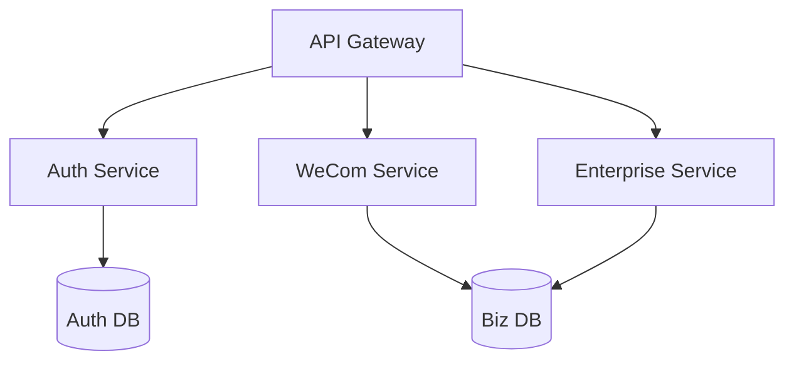

# 企业微信服务

本服务实现与企业微信交互的各种接口：
1. 获取客户联系人
2. 拉群
3. 与客户对话

本服务使用 FastAPI 框架来提供 HTTP 服务，处理企业微信的回调验证，并推送消息给给订阅者。

# 创建生产环境
```bash
conda create -n wecom-prod python=3.11 -y
conda activate wecom-prod
pip install .
```

# 创建开发环境
```bash
conda create -n wecom-dev python=3.11 -y
conda activate wecom-dev
pip install .[dev,alembic]

# 运行测试
pytest tests/ -v
```

# 安装文档依赖
```
pip install .[docs]
```

# Docker 运行命令
```bash
# 开发环境
docker build -t wecom .
docker run -d \
  --name wecom-dev \
  --env-file configs/dev.env \
  -p 8000:8000 \
  wecom

# 生产环境
docker run -d \
  --name wecom-prod \
  --env-file configs/prod.env \
  -p 8000:8000 \
  wecom
```


请求处理流程：
```Plain Text
客户端请求 → API网关 → 认证服务 → 负载企业配置 → 路由到对应微服务
           ↓
       监控埋点 → 日志中心
```